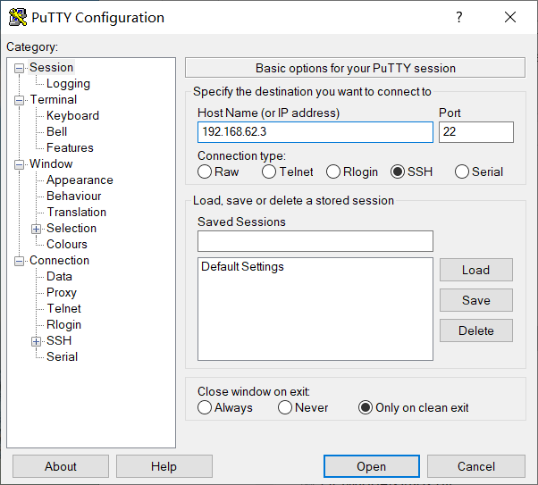

#第一次作业
***1.如何配置无人值守安装iso并在VIRTUALBOX中完成自动化安装？
2.VB安装完ubuntu之后新添加的网卡如何实现系统开机自动启用和自动获取IP?
3.如何使用sftp在虚拟机和宿主机之间传输文件？***
##环境配置
***ubuntu-18.04-server-amd64.iso***
## 目标

* 定制一个普通用户名和默认密码

* 定制安装OpenSSH Server

* 安装过程禁止自动联网更新软件包
###配置ssh和putty
配置好了两个网卡host-only和nat

下载好putty

用ifconfig找到id配置putty

putty连接好虚拟机

psftp下载好iso传入虚拟机中
输入命令如下：
创建一个用于挂载iso镜像文件的目录
  mkdir cuixinzhe
挂载iso文件
  mount -o loop ubuntu.iso loopdir
用于克隆光盘内容
  mkdir cd
同步光盘内容到目标工作目录
rsync -av loopdir/ cd
卸载镜像
umount loopdir
进入目标目录
  cd cd/ 
###编辑Ubuntu安装引导界面增加一个新菜单项入口
 vim isolinux/txt.cfg
### 添加以下内容到该文件
 	label autoinstall
 	  menu label ^Auto Install Ubuntu Server
 	  kernel /install/vmlinuz
 	  append  file=/cdrom/preseed/ubuntu-server-autoinstall.seed debian-installer/locale=en_US console-setup/layoutcode=us keyboard-configuration/layoutcode=us console-setup/ask_detect=false localechooser/translation/warn-light=true localechooser/translation/warn-severe=true initrd=/install/initrd.gz root=/dev/ram rw quiet
 
###下载好.seed镜像
生成md5
  	cd ~/cd && find . -type f -print0 | xargs -0 md5sum > md5sum.txt
封闭改动后的目录到.iso
  	IMAGE=custom.iso
BUILD=~/cd/
			
	mkisofs -r -V "Custom Ubuntu Install CD" \
	           -cache-inodes \
	           -J -l -b isolinux/isolinux.bin \
	           -c isolinux/boot.cat -no-emul-boot \
			           -boot-load-size 4 -boot-info-table \
			           -o $IMAGE $BUILD

报错，需要下载genisoimage，因为没有mkisofs
生成iso，将镜像使用psftp传至宿主机。
###参考资料
https://github.com/CUCCS/linux-2019-Wzy-CC/pull/1/commits/84f0cfd7dc9e78c0e0497a3adfa15eec3d190733
https://www.bilibili.com/video/av86360030
https://www.bilibili.com/video/av86360440
https://www.jianshu.com/p/b5d02b01842b
https://blog.csdn.net/zhaoxixc/article/details/82314957
