# 第五章实验

---

* ### 本实验配置了两台虚拟机，一台作为服务器端，一台作为客户端，系统版本Ubuntu18.04，服务器端的host-only网卡IP地址为192.168.56.101，客户端host-only网卡IP地址为192.168.56.104
* ### 在实验前先配置从服务器端通过ssh免密登录到客户端

生成并传输密钥

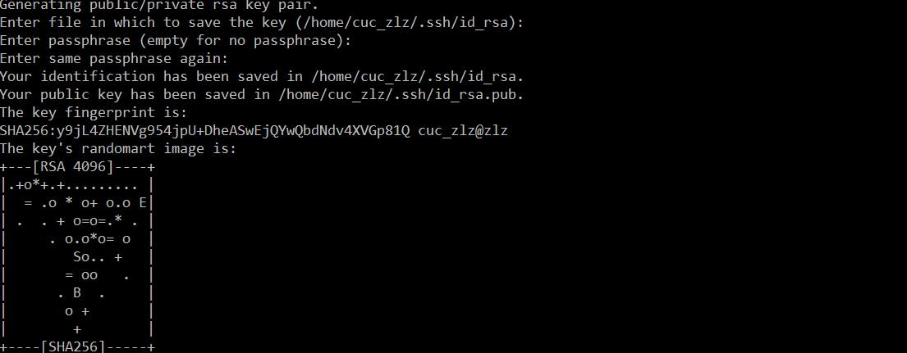

免密登录成功

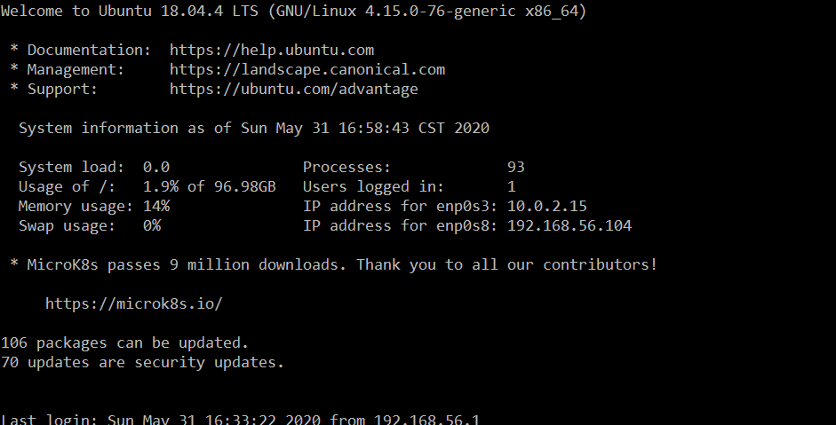

---

## FTP服务器配置任务

软件环境：proftpd

* [X] 配置一个提供匿名访问的FTP服务器，匿名访问者可以访问1个目录且仅拥有该目录及其所有子目录的只读访问权限；
* [X] 配置一个支持用户名和密码方式访问的账号，该账号继承匿名访问者所有权限，且拥有对另1个独立目录及其子目录完整读写（包括创建目录、修改文件、删除文件等）权限；
    * 该账号仅可用于FTP服务访问，不能用于系统shell登录；
* [X] FTP用户不能越权访问指定目录之外的任意其他目录和文件；
* [X] 匿名访问权限仅限白名单IP来源用户访问，禁止白名单IP以外的访问；

### 1. 在服务器端安装proftpd

```
sudo apt update
sudo apt install proftpd
```

### 2. 配置一个提供匿名访问的FTP服务器，匿名访问者可以访问1个目录且仅拥有该目录及其所有子目录的只读访问权限

修改配置文件proftpd.conf

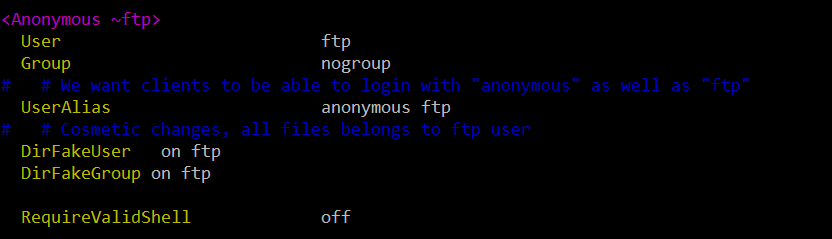


### 3. 配置一个支持用户名和密码方式访问的账号，该账号继承匿名访问者所有权限，且拥有对另1个独立目录及其子目录完整读写（包括创建目录、修改文件、删除文件等）权限，该账号仅可用于FTP服务访问，不能用于系统shell登录

修改配置文件proftpd.conf

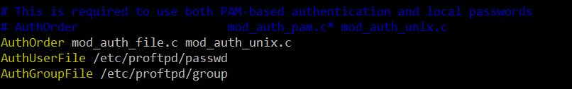

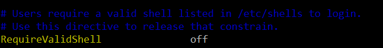

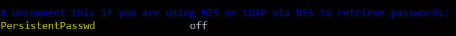

```
#创建虚拟用户的本地ftp文件夹
sudo mkdir /home/virtual
#创建用户
sudo ftpasswd --passwd --file=/etc/proftpd/passwd --name=virtual_ftp --uid=1025 --home=/home/virtual --shell=/bin/false
#创建用户组
sudo ftpasswd --file=/etc/proftpd/group --group --name=virtual_ftp_users --gid=1024
#将用户加入用户组
sudo ftpasswd --group --name=virtual_ftp_users --gid=1024 --member=virtual_ftp --file=/etc/proftpd/group
#修改文件夹权限
sudo chown -R 1024:1024 /home/virtual
sudo chmod -R 700 /home/virtual
```

### 4. FTP用户不能越权访问指定目录之外的任意其他目录和文件

修改配置文件proftpd.conf


### 5. 匿名访问权限仅限白名单IP来源用户访问，禁止白名单IP以外的访问

修改配置文件proftpd.conf

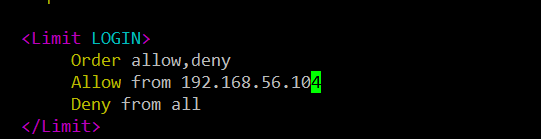

### 6. 配置结果展示

匿名访问ftp服务器测试

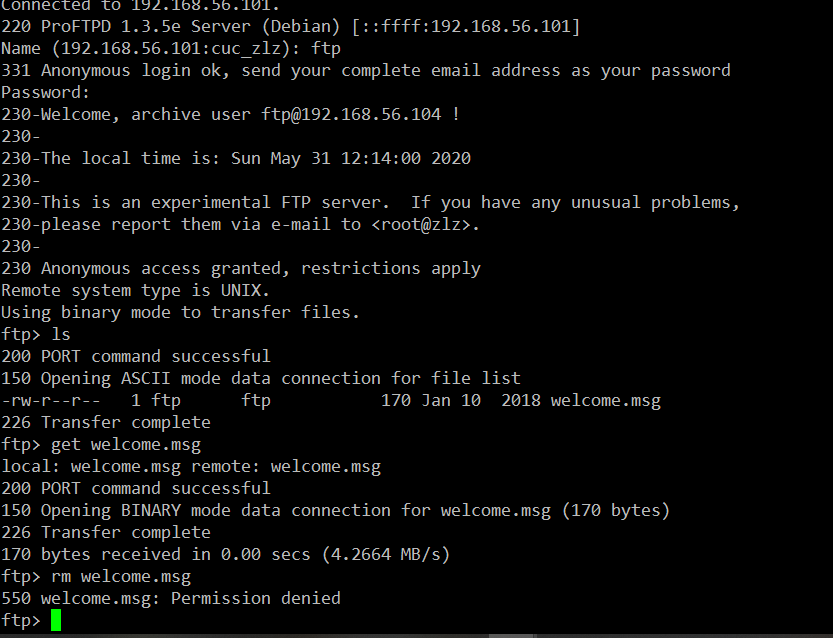

白名单屏蔽结果

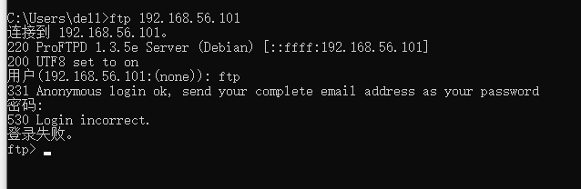

---

## NFS服务器配置任务

* [X] 在1台Linux上配置NFS服务，另1台电脑上配置NFS客户端挂载2个权限不同的共享目录，分别对应只读访问和读写访问权限；
* [X] 实验报告中请记录你在NFS客户端上看到的：
    * 共享目录中文件、子目录的属主、权限信息
    * 你通过NFS客户端在NFS共享目录中新建的目录、创建的文件的属主、权限信息
    * 上述共享目录中文件、子目录的属主、权限信息和在NFS服务器端上查看到的信息一样吗？无论是否一致，请给出你查到的资料是如何讲解NFS目录中的属主和属主组信息应该如何正确解读

### 1. 在1台Linux上配置NFS服务，另1台电脑上配置NFS客户端挂载2个权限不同的共享目录，分别对应只读访问和读写访问权限

安装NFS服务

```
sudo apt update
sudo apt install nfs-kernel-server 
```

安装NFS客户端

```
sudo apt update
sudo apt install nfs-common
```

在服务器端创建共享目录

```
sudo mkdir /var/nfs/general -p
sudo chown nobody:nogroup /var/nfs/general
```

配置服务器端NFS配置文件，/home为只读访问，/var/nfs.general为读写访问

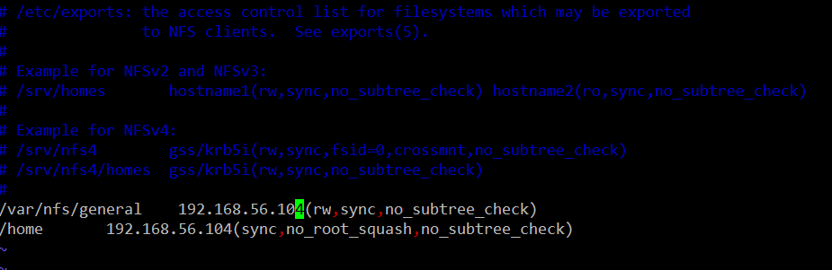

在客户端上创建挂载点和挂载目录

```
sudo mkdir -p /nfs/general
sudo mkdir -p /nfs/home
sudo mount 192.168.56.101:/var/nfs/general /nfs/
sudo mount 192.168.56.101:/home /nfs/home
```

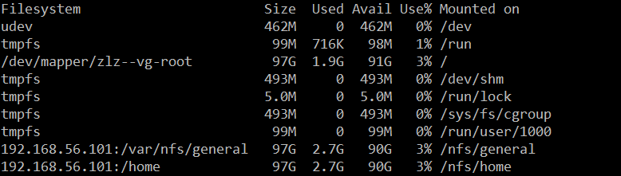

### 2. NFS客户端

通过NFS客户端在NFS共享目录中新建的目录、创建的文件的属主、权限信息

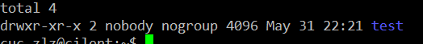

服务器端信息

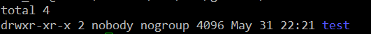


添加了 no_root_squash参数，可以使用root 用户

---

## DHCP服务器配置任务
    
* [X] 2台虚拟机使用Internal网络模式连接，其中一台虚拟机上配置DHCP服务，另一台服务器作为DHCP客户端，从该DHCP服务器获取网络地址配置

### 1. 配置服务器端的intnet网卡

服务器端配置

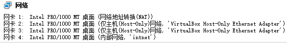

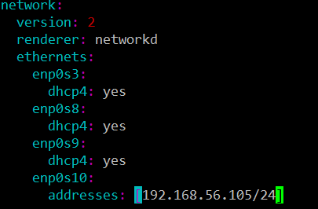

配置结果

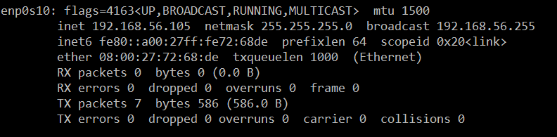

### 2. 在服务器端安装isc-dhcp-server

```
sudo apt update
sudo apt install isc-dhcp-server
```

### 3. 修改服务器端配置文件

修改/etc/default/isc-dhcp-server

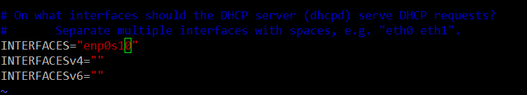

修改/etc/dhcp/dhcpd.conf

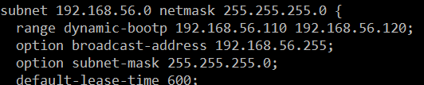

### 4. 配置客户端网卡

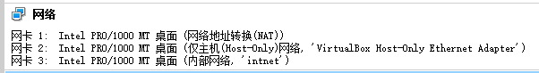

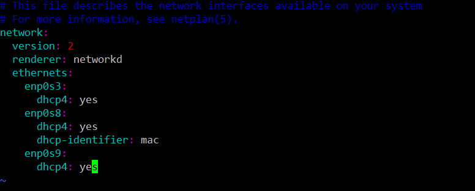

实验结果

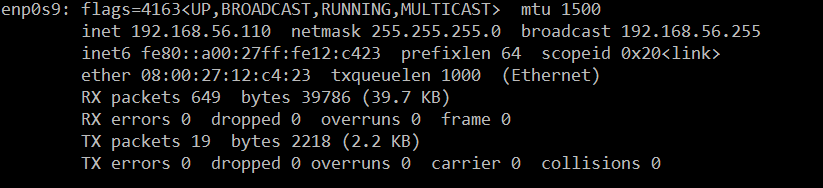

---

## Samba服务器配置和客户端配置连接测试

* [X] Linux访问Windows的匿名共享目录
* [X] Linux访问Windows的用户名密码方式共享目录
* [ ] 下载整个目录

### 1. 在Linux上配置Samba服务器

安装Samba

```
sudo apt update
# 安装Samba服务器
sudo apt-get install samba
# 创建Samba共享专用的用户
sudo useradd -M -s /sbin/nologin demoUser
sudo passwd demoUser
# 创建的用户必须有一个同名的Linux用户，密码是独立的
sudo smbpasswd -a demoUser
sudo groupadd demoGroup
sudo usermod -aG demoGroup demoUser
# 创建共享文件夹
sudo mkdir -p srv/samba/demo/
sudo mkdir -p /srv/samba/guest/
sudo chgrp -R demoGroup /srv/samba/guest/
sudo chgrp -R demoGroup /srv/samba/demo/
sudo chmod 2775 /srv/samba/guest/
sudo chmod 2770 /srv/samba/demo/
```

更改服务器设置

```
# 在/etc/samba/smb.conf 文件尾部追加以下“共享目录”配置
[guest]  
    path = /srv/samba/guest/  
    read only = yes  
    guest ok = yes
[demo]
        path = /srv/samba/demo/
        read only = no
        guest ok = no
        force create mode = 0660
        force directory mode = 2770
        force user = demoUser
        force group = demoGroup
```
### 2. 配置Linux Samba客户端

安装Samba客户端

```
sudo apt updata
sudo apt-get install smbclient
```

配置结果

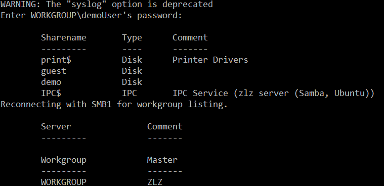

### 3. Linux访问Windows的匿名共享目录


### 4. Linux访问Windows的用户名密码方式共享目录

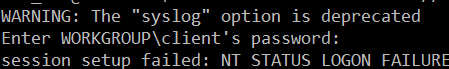

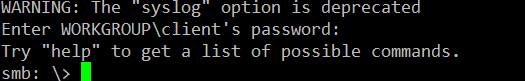

---

## DNS

* [X] 基于上述Internal网络模式连接的虚拟机实验环境，在DHCP服务器上配置DNS服务，使得另一台作为DNS客户端的主机可以通过该DNS服务器进行DNS查询
    * 在DNS服务器上添加 `zone "cuc.edu.cn"` 的以下解析记录

```
ns.cuc.edu.cn NS
ns A <自行填写DNS服务器的IP地址>
wp.sec.cuc.edu.cn A <自行填写第5章实验中配置的WEB服务器的IP地址>
dvwa.sec.cuc.edu.cn CNAME wp.sec.cuc.edu.cn
```

### 1. 服务器端安装bind9

```
sudo apt update
sudo apt install bind9
```

### 2. 修改服务器端配置文件

修改/etc/bind/named.conf.local

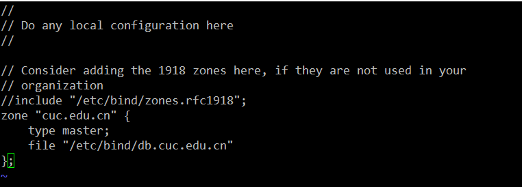

修改添加解析记录db.cuc.edu.cn

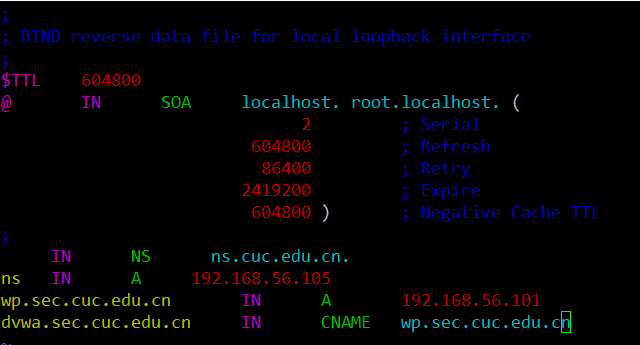

重启bind9服务

```
sudo systectl restart bind9
```

### 3. 配置客户端

修改配置文件

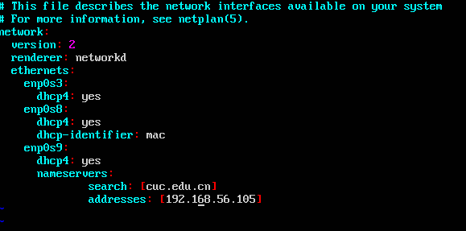

---

ps：config文件夹中保存着实验用到的所有配置文件，shell文件夹中保存着本次实验所编写的shell脚本，shell文件夹中的vars.sh定义许多变量，是配置文件，main.sh是一键部署的入口脚本，调用 ssh-root.sh 配置目标机的root用户免密ssh登录，调用 apt-install.sh 在目标机上安装必要的程序，并对配置文件进行备份，调用 action.sh 在目标机上进行创建用户、创建目录、修改权限、重启服务等必要的操作


参考资料：

* [linux/2017-1/snRNA/ex6/](https://github.com/CUCCS/linux/tree/master/2017-1/snRNA/ex6)
* [Setting up Samba as a Standalone Server](https://wiki.samba.org/index.php/Setting_up_Samba_as_a_Standalone_Server)
* [Domain Name Service (DNS)](https://ubuntu.com/server/docs/service-domain-name-service-dns)