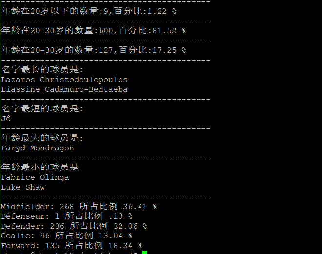

## shell实验报告

#### 实验环境

-   ubuntu18.04

#### 实验工具

- shell

#### 任务一：用bash编写一个图片批处理脚本，实现以下功能

- 支持命令行参数方式使用不同功能
- 支持对指定目录下所有支持格式的图片文件进行批处理
- 支持以下常见图片批处理功能的单独使用或组合使用
  - 支持对jpeg格式图片进行图片质量压缩
  - 支持对jpeg/png/svg格式图片在保持原始宽高比的前提下压缩分辨率
  - 支持对图片批量添加自定义文本水印
  - 支持批量重命名（统一添加文件名前缀或后缀，不影响原始文件扩展名）
  - 支持将png/svg图片统一转换为jpg格式图片

##### 帮助信息

```
usage: $0 [-f filename][-cq percent][-cs percent][-ctj][-tw text][-sr suffixrename][-pr prefixrename][-bp directory][-h]

optional arguments:
-f,  --file <filename>                      The filename
-cq, --compress_q <percent> [newfilename]   Image compression,quality is interget
-cs, --compress_s <percent> [newfilename]   Compresse image resolution,percent is interget
-ctj, --changetojpg                         Change image format to jpg(Keep Original Image)
-tw, --textwatermark <text>                 Add text watermark
-sr, --suffixname <suffix>                  Add suffixname(jpeg,jpg,png,svg)
-pr, --prefixname  <prefixname>             Add prefixname(jpeg,jpg,png,svg)
-bp, --batchprocessing <directory>          Batch processing of image
-h,  --help
```

##### 实例

```shell
# 对jpeg格式图片进行图片质量压缩
bash ImageProcess.sh -f /workspace/shell/test.jpg -cq 20

# 对jpeg/png/svg格式图片在保持原始宽高比的前提下压缩分辨率
bash ImageProcess.sh -f /workspace/shell/test.jpg -cs 20

# 对图片添加自定义文本水印
bash ImageProcess.sh -f /workspace/shell/test.jpg -tw testworkmark

# 对图片重命名
bash ImageProcess.sh -f /workspace/shell/test.jpg -pr test
bash ImageProcess.sh -f /workspace/shell/test.jpg -sr test

#png/svg图片统一转换为jpg格式图片
bash ImageProcess.sh -f /workspace/shell/test.jpg -ctj
```


#### 任务二：用bash编写一个文本批处理脚本，对以下附件分别进行批量处理完成相应的数据统计任务：

- [2014世界杯运动员数据](http://sec.cuc.edu.cn/huangwei/course/LinuxSysAdmin/exp/chap0x04/worldcupplayerinfo.tsv)

  - 统计不同年龄区间范围（20岁以下、[20-30]、30岁以上）的球员**数量**、**百分比**
  - 统计不同场上位置的球员**数量**、**百分比**
  - 名字最长的球员是谁？名字最短的球员是谁？
  - 年龄最大的球员是谁？年龄最小的球员是谁？

  ##### 实验结果

  

#### 任务三：用bash编写一个文本批处理脚本，对以下附件分别进行批量处理完成相应的数据统计任务：

- [Web服务器访问日志](http://sec.cuc.edu.cn/huangwei/course/LinuxSysAdmin/exp/chap0x04/web_log.tsv.7z)

  - 统计访问来源主机TOP 100和分别对应出现的总次数
  - 统计访问来源主机TOP 100 IP和分别对应出现的总次数
  - 统计最频繁被访问的URL TOP 100
  - 统计不同响应状态码的出现次数和对应百分比
  - 分别统计不同4XX状态码对应的TOP 10 URL和对应出现的总次数
  - 给定URL输出TOP 100访问来源主机

  ##### 帮助信息

  ```
  usage $0: WebProcessing.sh [-sh][-si][-sc][-u][-uh][-fs][-h]
  optional arguments:
  -sh             统计访问来源主机TOP 100和分别对应出现的总次数
  -si             统计访问来源主机TOP 100 IP和分别对应出现的总次数
  -sc             统计不同响应状态码的出现次数和对应百分比
  -u              统计最频繁被访问的URL TOP 100
  -uh <url>       给定URL输出TOP 100访问来源主机
  -fs             分别统计不同4XX状态码对应的TOP 10 URL和对应出现的总次数
  -h,  --help"
  ```


#### 参考资料

- [Linux-2017-FitBC](<https://github.com/FitzBC/linux/tree/0636a22f94a388f3869d799cdc7c22cd693ed214/2017-1/FitzBC/%E5%AE%9E%E9%AA%8C4>)

- [extract-filename-and-extension-in-bash](http://stackoverflow.com/questions/965053/extract-filename-and-extension-in-bash)
- [resize-convert](https://www.howtogeek.com/109369/how-to-quickly-resize-convert-modify-images-from-the-linux-terminal/)
- [check-if-a-program-exists](https://stackoverflow.com/questions/592620/how-to-check-if-a-program-exists-from-a-bash-script)
- [easy-watermarking-imagemagick](https://www.linuxjournal.com/content/easy-watermarking-imagemagick)
- [compress-images](https://askubuntu.com/questions/781497/how-can-i-compress-images)
- [get-information-about-an-image-picture](https://superuser.com/questions/275502/how-to-get-information-about-an-image-picture-from-the-linux-command-line)
- [takes-optional-input-arguments](https://stackoverflow.com/questions/9332802/how-to-write-a-bash-script-that-takes-optional-input-arguments)
- [linuxcommand](http://linuxcommand.org/lc3_wss0120.php)
- [validating-ip-address-bash-script](https://www.linuxjournal.com/content/validating-ip-address-bash-script)
- [get-the-char-at-a-given-position-of-a-string](<https://unix.stackexchange.com/questions/9468/how-to-get-the-char-at-a-given-position-of-a-string-in-shell-script>)
- [get-the-list-of-files-in-a-directory](<https://stackoverflow.com/questions/2437452/how-to-get-the-list-of-files-in-a-directory-in-a-shell-script>)
- [sed](<http://man.linuxde.net/sed>)
- [removing-all-spaces-tabs-newlines-etc-from-a-variable](<https://unix.stackexchange.com/questions/32569/removing-all-spaces-tabs-newlines-etc-from-a-variable>)

